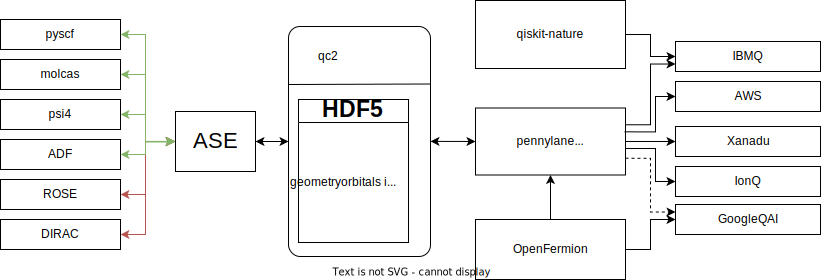

# Architecture of the package 

The overall structure of the package is illustrated in this picture



## Data structure of the HDF5 file

The hdf5 file should contain:
```
.
+-- geometry.xyz
+-- QuantumChemistry
|   +-- atomic orbitals
|   +-- molecular orbitals / energies
|   +-- integrals 
|   +-- ...
+-- QuantumComputing
|   +-- circuits
|   +-- outputs
|   +-- ...
+-- ...
```

## Quantum chemistry 
The package is organized around a HDF5 file that can be populated by different quanutm chemistry codes. 

### ASE
Interfacing between different codes can be done via ASE (https://wiki.fysik.dtu.dk/ase/). It already supports most of the qchem packages we need. We would only need to create a cacluator for ROSE and DIRAC. 
Each new qchem package would then be in charge to povide their own ase caclulator. The inputs parameters are all a bit different for  each qchem packages and we will have to homogenize that to store in the HDF5 file


#### QMFlows
Otherwise we can try to revive QMFlows (https://qmflows.readthedocs.io/en/latest/index.html). In that case we have a common set of input parameters that are translated into the specifics keywords required by each package. 
However only a handful of qchem packages are currently supported and we will need to extend that significantly.

## Quantum Computing

We can either try to develop/adapt a common syntax for the different qc libraries or we devleop dedicated connectors between the data contained in the hdf5 file and the qc libraries ... 


